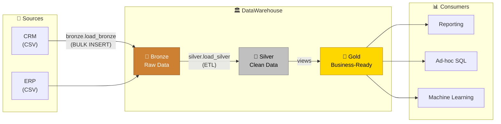
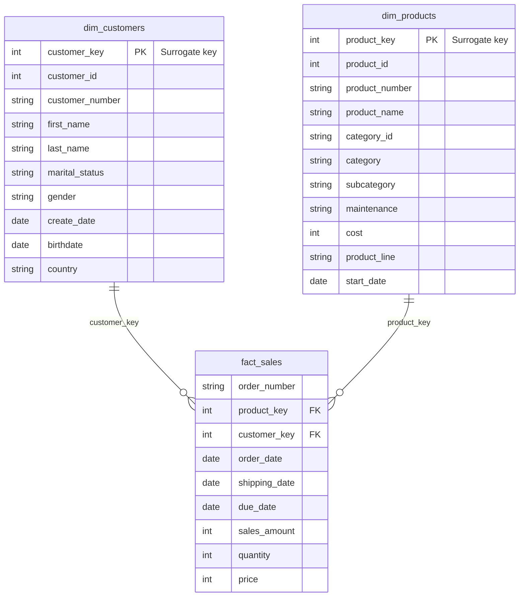

<div align="center">

# 🏛️ SQL Data Warehouse Project

**An end-to-end data warehouse built in SQL Server using the Medallion Architecture (Bronze → Silver → Gold)**


[Overview](#-overview) •
[Architecture](#%EF%B8%8F-data-architecture) •
[Data Model](#-gold-layer--star-schema) •
[Getting Started](#-getting-started) •
[Example Queries](#-example-queries)

</div>

---

## 📖 Overview

This project consolidates sales data from two source systems, a **CRM** and an **ERP**, into a single, analytics-ready data warehouse. Raw CSV exports are ingested, cleansed, standardized, and finally modelled into a **star schema** that can be queried directly for reporting, ad-hoc SQL analysis, and machine learning.

### ✨ Highlights

| | |
|---|---|
| 🥉 **Bronze** | Raw CSV files bulk-loaded as-is for traceability and auditing |
| 🥈 **Silver** | Cleansing, deduplication, standardization, and key alignment between CRM & ERP |
| 🥇 **Gold** | Business-ready star schema (`dim_customers`, `dim_products`, `fact_sales`) exposed as views |
| ⏱️ **Observability** | Every load prints per-table and whole-batch durations |
| 🛡️ **Error handling** | `TRY...CATCH` blocks report error message, number, and state |
| 🔁 **Re-runnable** | Idempotent setup, truncate-and-insert loads, and `CREATE OR ALTER` views |

### 📈 By the Numbers

| Source rows | Customers | Products (current) | Sales order lines |
|:---:|:---:|:---:|:---:|
| **~116K** across 6 CSV files | **18,484** | **295** | **60,398** |

---

## 🏗️ Data Architecture

<p align="center">
  
</p>

| Layer | Object Type | Load Strategy | Transformations | Purpose |
|:---:|:---:|:---:|:---|:---|
| 🥉 **Bronze** | Tables | Batch · Full Load · Truncate & Insert | None | Raw copy of the source data |
| 🥈 **Silver** | Tables | Batch · Full Load · Truncate & Insert | Cleansing, normalization, standardization, derived columns | Clean, conformed data |
| 🥇 **Gold** | Views | No load (computed on query) | Data integration, business logic | Star schema for consumers |



---

## 🔄 Data Flow

<p align="center">
  
</p>

Each of the six source files flows through Bronze and Silver as its own table, then gets combined in Gold:

- **`fact_sales`** ← `crm_sales_details`
- **`dim_customers`** ← `crm_cust_info` + `erp_cust_az12` + `erp_loc_a101`
- **`dim_products`** ← `crm_prd_info` + `erp_px_cat_g1v2`

---

## 🔗 Data Integration

<p align="center">
  
</p>

The CRM and ERP systems use different key formats, so the Silver layer reshapes keys to make them joinable:

| Join | CRM key | ERP key (raw) | Fix applied in Silver |
|---|---|---|---|
| Customer ↔ Demographics | `cst_key` = `AW00011000` | `cid` = `NASAW00011000` | Strip the `NAS` prefix |
| Customer ↔ Location | `cst_key` = `AW00011000` | `cid` = `AW-00011000` | Remove the hyphen |
| Product ↔ Category | `prd_key` = `CO-RF-FR-R92B-58` | `id` = `CO_RF` | First 5 chars of `prd_key`, `-` → `_` |
| Sales ↔ Product | `sls_prd_key` = `FR-R92B-58` | n/a | Product key = `prd_key` from position 7 |

---

## ⭐ Gold Layer: Star Schema



| View | Grain | Notes |
|---|---|---|
| `gold.dim_customers` | One row per customer | CRM is the master for gender; ERP fills in when CRM is `N/A` |
| `gold.dim_products` | One row per **current** product | Historical product versions are filtered out |
| `gold.fact_sales` | One row per sales order line | Source IDs replaced by dimension surrogate keys |

---

## 🧹 Silver Layer: Cleansing Rules

<details>
<summary><b>👤 crm_cust_info</b></summary>

- Trims whitespace from first and last names
- Maps marital status `S`/`M` → `Single`/`Married`, gender `F`/`M` → `Female`/`Male`, everything else → `N/A`
- Deduplicates on `cst_id`, keeping the **most recent** record, and drops rows with a missing `cst_id`
</details>

<details>
<summary><b>📦 crm_prd_info</b></summary>

- Splits `prd_key` into `cat_id` and the product key used by sales
- Maps product line `M`/`R`/`S`/`T` → `Mountain`/`Road`/`Other Sales`/`Touring`
- Rebuilds `prd_end_dt` as the day before the next version's start date (`LEAD()`), so the current version has a `NULL` end date
</details>

<details>
<summary><b>🧾 crm_sales_details</b></summary>

- Converts `YYYYMMDD` integers to `DATE`; `0` or malformed values become `NULL`
- Recalculates `sls_sales = quantity × |price|` when missing, non-positive, or inconsistent
- Derives `sls_price = sales ÷ quantity` when missing or non-positive (with `NULLIF` to avoid divide-by-zero)
</details>

<details>
<summary><b>🎂 erp_cust_az12</b></summary>

- Removes the `NAS` prefix from `cid`
- Sets future birth dates to `NULL`
- Normalizes gender to `Female` / `Male` / `N/A`
</details>

<details>
<summary><b>🌍 erp_loc_a101</b></summary>

- Removes hyphens from `cid`
- Normalizes countries: `DE` → `Germany`, `US`/`USA` → `United States`, blank → `N/A`
</details>

<details>
<summary><b>🏷️ erp_px_cat_g1v2</b></summary>

- Already clean in the source; copied through from Bronze
</details>

---

## 📂 Repository Structure

```
SQL-Data-Warehouse-Project/
│
├── 📁 datasets/                         # Raw source data (CSV)
│   ├── source_crm/
│   │   ├── cust_info.csv                # Customer master       (~18.5K rows)
│   │   ├── prd_info.csv                 # Product history       (397 rows)
│   │   └── sales_details.csv            # Sales order lines     (~60.4K rows)
│   └── source_erp/
│       ├── CUST_AZ12.csv                # Customer demographics (~18.5K rows)
│       ├── LOC_A101.csv                 # Customer locations    (~18.5K rows)
│       └── PX_CAT_G1V2.csv              # Product categories    (37 rows)
│
├── 📁 docs/                             # Architecture diagrams
│   ├── Data Architecture.png
│   ├── Data Flow Diagram.png
│   └── Data Integration.png
│
├── 📁 scripts/                          # T-SQL scripts (run in this order)
│   ├── init_database.sql                # 1️⃣ Create database + bronze/silver/gold schemas
│   ├── bronze/
│   │   ├── ddl_bronze.sql               # 2️⃣ Create Bronze tables
│   │   └── data_loading_bronze.sql      # 3️⃣ bronze.load_bronze procedure (BULK INSERT)
│   ├── silver/
│   │   ├── ddl_silver.sql               # 4️⃣ Create Silver tables
│   │   └── data_loading_silver.sql      # 5️⃣ silver.load_silver procedure (ETL)
│   └── gold/
│       └── ddl_gold.sql                 # 6️⃣ Star schema views
│
└── README.md
```

---

## 🚀 Getting Started

### Prerequisites

- [SQL Server](https://www.microsoft.com/en-us/sql-server/sql-server-downloads) (Express or Developer edition is free)
- [SQL Server Management Studio (SSMS)](https://learn.microsoft.com/en-us/sql/ssms/download-sql-server-management-studio-ssms) or Azure Data Studio

### Setup

**1. Clone the repository**

```bash
git clone https://github.com/Manthan27525/SQL-Data-Warehouse-Project.git
```

**2. Update the CSV paths**

> [!IMPORTANT]
> `scripts/bronze/data_loading_bronze.sql` uses absolute paths (`D:\Project\SQL-Data-Warehouse-Project\datasets\...`). Change them to match where you cloned the repo, and make sure the SQL Server service account can read that folder.

**3. Run the scripts in order**

| Step | Script | What it does |
|:---:|---|---|
| 1️⃣ | `scripts/init_database.sql` | Creates the `DataWarehouse` database and the `bronze`, `silver`, `gold` schemas (safe to re-run) |
| 2️⃣ | `scripts/bronze/ddl_bronze.sql` | Creates the Bronze tables |
| 3️⃣ | `scripts/bronze/data_loading_bronze.sql` | Creates and runs `bronze.load_bronze` |
| 4️⃣ | `scripts/silver/ddl_silver.sql` | Creates the Silver tables |
| 5️⃣ | `scripts/silver/data_loading_silver.sql` | Creates and runs `silver.load_silver` |
| 6️⃣ | `scripts/gold/ddl_gold.sql` | Creates the Gold views |

Run step 1 from any database. Run steps 2–6 while connected to `DataWarehouse`.

<details>
<summary><b>⚡ Run everything from the command line with sqlcmd</b></summary>

```bash
sqlcmd -S localhost -E -C -b -i scripts/init_database.sql
sqlcmd -S localhost -E -C -b -d DataWarehouse -i scripts/bronze/ddl_bronze.sql
sqlcmd -S localhost -E -C -b -d DataWarehouse -i scripts/bronze/data_loading_bronze.sql
sqlcmd -S localhost -E -C -b -d DataWarehouse -i scripts/silver/ddl_silver.sql
sqlcmd -S localhost -E -C -b -d DataWarehouse -i scripts/silver/data_loading_silver.sql
sqlcmd -S localhost -E -C -b -d DataWarehouse -i scripts/gold/ddl_gold.sql
```
</details>

### 🔁 Refreshing the data

Once everything is set up, reload the warehouse with two calls. The Gold views update automatically.

```sql
EXEC bronze.load_bronze;
EXEC silver.load_silver;
```

---

## 📊 Example Queries

```sql
-- Revenue by country
SELECT c.country, SUM(f.sales_amount) AS total_sales
FROM gold.fact_sales f
JOIN gold.dim_customers c ON f.customer_key = c.customer_key
GROUP BY c.country
ORDER BY total_sales DESC;

-- Top 10 products by revenue
SELECT TOP 10 p.product_name, p.category, SUM(f.sales_amount) AS revenue
FROM gold.fact_sales f
JOIN gold.dim_products p ON f.product_key = p.product_key
GROUP BY p.product_name, p.category
ORDER BY revenue DESC;

-- Yearly sales trend
SELECT YEAR(order_date) AS order_year,
       SUM(sales_amount) AS total_sales,
       COUNT(DISTINCT customer_key) AS customers
FROM gold.fact_sales
WHERE order_date IS NOT NULL
GROUP BY YEAR(order_date)
ORDER BY order_year;
```

**Sample output: revenue by country (top 5)**

| country | total_sales |
|---|---:|
| United States | 9,162,327 |
| Australia | 9,060,172 |
| United Kingdom | 3,391,376 |
| Germany | 2,894,066 |
| France | 2,643,751 |

---

## 🛠️ Tech Stack

| Tool | Usage |
|---|---|
| **Microsoft SQL Server** | Database engine hosting the warehouse |
| **T-SQL** | DDL, stored procedures, ETL logic, views |
| **SSMS** | Development and query execution |
| **draw.io** | Architecture, data flow, and integration diagrams |
| **Git & GitHub** | Version control |

---

<div align="center">

### 👤 Author

**Manthan Singh**

[](https://github.com/Manthan27525)

⭐ If you found this project helpful, consider giving it a star!

</div>
